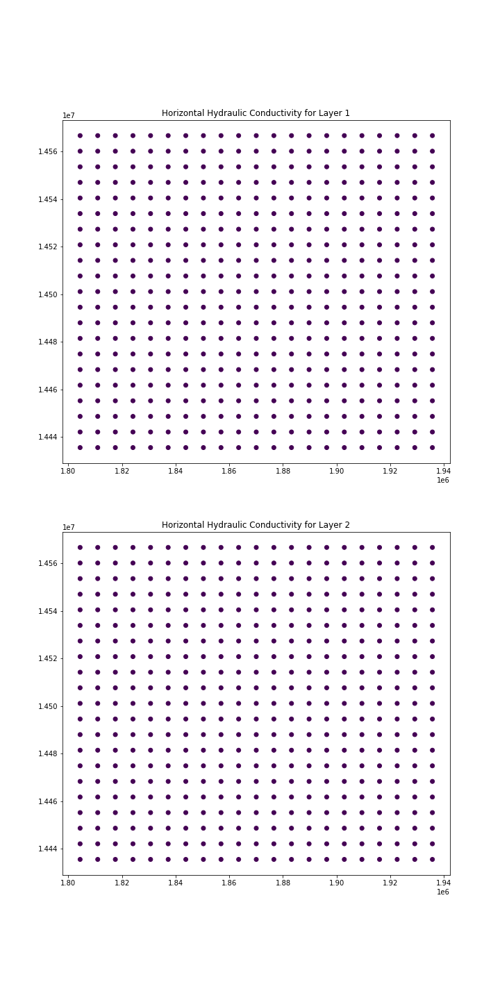

****************
PyWFM Tutorial 2
****************

Created by: Tyler Hatch/DWR

**Description:** This tutorial walks a user of pywfm through how to obtain the aquifer horizontal K values
and plot them.

.. important::
   
   This tutorial assumes the model has run successfully and all outputs are available to use for inquiry

Getting Started
===============

.. code-block:: py

   import numpy as np
   import pandas as pd
   import matplotlib.pyplot as plt
   
   from pywfm import IWFMModel
   
Set Paths to the IWFM DLL, Preprocessor Input File, and Simulation Input File
=============================================================================

.. code-block:: py

   # specify path to IWFM DLL
   dll = '../../DLL/Bin/IWFM2015_C_x64.dll'
    
   # specify paths to preprocessor and simulation main files
   pp_file = '../Preprocessor/PreProcessor_MAIN.IN'
   sim_file = 'Simulation_MAIN.IN'
   
.. important::

   These paths assume this code is saved in the simulation folder of the Sample Model and the DLL is in a location
   relative to the simulation folder
   

Create the Model Object
=======================

.. code-block:: py

   sm = IWFMModel(dll, pp_file, sim_file)
   

Retrieve Node IDs and Node Coordinates
======================================

.. code-block:: py

   nodes = sm.get_node_info()

.. note::
   
   the get_node_info method returns the data in a pandas DataFrame object
   

Retrieve Horizontal Hydraulic Conductivity values at each nodes
===============================================================

.. code-block:: py
      
   aquifer_hk = sm.get_aquifer_horizontal_k()
   

Add Hydraulic Conductivities for each layer to the nodes DataFrame
==================================================================

.. code-block:: py

   for i in range(aquifer_hk.shape[0]):
       nodes['Layer{}_HK'.format(i+1)] = aquifer_hk[i]
	   

Plot Hydraulic Conductivities for each model layer
==================================================

.. code-block:: py

   fig, ax = plt.subplots(nrows=aquifer_hk.shape[0], figsize=(10,20))
   ax[0].scatter(nodes.X, nodes.Y, c=nodes.Layer1_HK)
   ax[0].set_title("Horizontal Hydraulic Conductivity for Layer 1")
   ax[1].scatter(nodes.X, nodes.Y, c=nodes.Layer2_HK)
   ax[1].set_title("Horizontal Hydraulic Conductivity for Layer 2")
   

   
Terminate the Model Object
==========================

.. code-block:: py

   sm.kill()
   
.. note::

   It may also be useful to call:
   
   .. code-block:: py
      
	  sm.delete_inquiry_data_file()